<p align="center">
  
</p>

<p align="center">
  <strong>Your second brain for the content you save but never revisit.</strong>
</p>

<p align="center">
  <a href="#quickstart">Quickstart</a> &#8226;
  <a href="#how-it-works">How It Works</a> &#8226;
  <a href="#supported-sources">Sources</a> &#8226;
  <a href="#dashboard">Dashboard</a> &#8226;
  <a href="#querying">Querying</a> &#8226;
  <a href="#telegram-bot">Telegram Bot</a>
</p>

---

## The Problem

You save dozens of useful reels, videos, repos, and articles every week. GitHub repos that solve exactly the problem you'll face next month. AI techniques from a YouTube breakdown. A Reddit thread with the perfect architecture pattern.

But when the moment comes, you've already forgotten where you saw it. It's buried in a feed, a bookmark folder, or a chat with yourself. The knowledge never compounds.

## What This Does

Knowledge Engine watches your saved content, extracts the useful signal, builds a structured knowledge graph, and makes it queryable. When you start a new project, it tells you exactly which repos, tools, methods, and architectures are relevant -- grounded in things you actually saved, not generic AI suggestions.

**Send a link. Get knowledge. Query it later.**

## Quickstart

```bash
# clone and install
git clone https://github.com/YOUR_USERNAME/knowledge-engine.git
cd knowledge-engine
npm install

# set up dependencies
brew install yt-dlp ffmpeg whisper-cpp

# ingest your first piece of content
npm run ke -- ingest https://github.com/vercel/next.js

# search your knowledge
npm run ke -- search "react framework"

# start the dashboard
npm run ke -- dashboard
# open http://localhost:3737
```

## How It Works

```
  Send a link (Telegram, CLI, or drop folder)
        |
        v
  +------------------+
  |   URL Router     |  Detects source type: IG, YT, GH, Reddit, arXiv...
  +------------------+
        |
        v
  +------------------+
  |   Extractor      |  Video: download -> transcribe -> OCR -> LLM
  |                  |  GitHub: API -> README + metadata -> LLM
  |                  |  Web: scrape -> clean -> LLM
  |                  |  Paper: arXiv API -> abstract -> LLM
  +------------------+
        |
        v
  +------------------+
  |   Knowledge      |  Entities, relationships, facts, topics,
  |   Graph          |  confidence scores, hype detection,
  |                  |  implementation readiness, provenance
  +------------------+
        |
        v
  +------------------+
  |   Query Layer    |  FTS5 + vector search + graph traversal
  |                  |  Project mode, weekly digests, trending
  +------------------+
```

Every piece of content becomes structured knowledge with full provenance back to the original source.

## Supported Sources

| Platform | What Gets Extracted | Method |
|---|---|---|
| **Instagram Reels** | Speech, on-screen text, captions, entities | yt-dlp + Whisper + OCR + LLM |
| **YouTube** | Full transcription, visual content, metadata | yt-dlp + Whisper + OCR + LLM |
| **TikTok** | Speech, text overlays, creator info | yt-dlp + Whisper + OCR + LLM |
| **GitHub Repos** | README, stars, language, topics, dependencies | gh API + LLM analysis |
| **GitHub Issues/PRs** | Discussion, context, linked resources | Web scrape + LLM |
| **Reddit Posts** | Post body, top comments, linked resources | JSON API + LLM |
| **Hacker News** | Thread content, top comments | Firebase API + LLM |
| **arXiv Papers** | Title, authors, abstract, categories | Atom API + LLM |
| **Twitter/X** | Post content, media, context | Web scrape + LLM |
| **Any Article** | Article text, metadata, key points | curl + HTML extraction + LLM |
| **Plain Text** | Direct notes, ideas, observations | LLM analysis |

## Dashboard

The web dashboard at `http://localhost:3737` gives you a live view of your knowledge base:

- **Project Mode** -- describe what you're building, get ranked recommendations
- **Knowledge Graph** -- interactive force-directed graph of entities and relationships
- **Entity Explorer** -- searchable, filterable list of every tool, repo, framework, and concept
- **Trending** -- what's showing up repeatedly across your saved content
- **Source Badges** -- visual indicators for each platform (IG, YT, GH, RD, HN, AX, TT)

```bash
npm run ke -- dashboard
# or with a custom port
npm run ke -- dashboard --port 4000
```

## Querying

### CLI

```bash
# full-text search across everything
npm run ke -- search "knowledge graph embeddings"

# get project recommendations
npm run ke -- recommend "building a RAG pipeline for documentation"

# explore an entity's connections
npm run ke -- graph "LangChain"

# see entity details
npm run ke -- entity "Next.js"

# weekly digest
npm run ke -- digest 7

# what's trending
npm run ke -- trending 30

# browse recent ingestions
npm run ke -- recent 20

# list all topics
npm run ke -- topics
```

### Project Mode

The killer feature. Describe a project and get back ranked recommendations from everything you've ever saved:

```bash
npm run ke -- recommend "real-time collaborative code editor with AI suggestions"
```

Returns:
- Relevant repos with stars, activity, and why they matter
- Tools and libraries that fit the architecture
- Techniques and patterns from your saved content
- Workflows others have used for similar problems
- Confidence scores, hype detection, and implementation readiness

Every recommendation links back to the exact source where you first saw it.

## Telegram Bot

The easiest way to feed content into the engine. Set up a Telegram bot and just forward or share links to it from any app.

### Setup

1. Message [@BotFather](https://t.me/BotFather) on Telegram
2. Send `/newbot`, pick a name, get your token
3. Configure the bot token in your environment or OpenClaw config

### Usage

Just send any URL to your bot:

```
https://github.com/anthropics/anthropic-sdk-python
```

The bot will reply with:
```
Ingesting GitHub Repo... This may take a minute.

Ingested GitHub Repo
Type: repo_recommendation
Summary: Official Python SDK for the Anthropic API...
Entities: anthropic-sdk-python, Anthropic, Python
Topics: sdk, api-client, ai-integration
```

Works with any URL from any platform. Share a reel from Instagram, a video from YouTube, a post from Reddit -- all through the same bot.

## Knowledge Graph

The engine doesn't just store text. It builds a typed knowledge graph with:

**15 entity types:** Repository, Tool, Model, Library, Framework, Paper, Company, Person, Technique, Workflow, Architecture, Product Idea, Benchmark, Trend

**13 relationship types:** mentions, recommends, improves, replaces, integrates_with, depends_on, similar_to, relevant_for, good_for, not_good_for, announced_by, compared_against, used_in

Every entity tracks:
- Canonical name and aliases
- Source provenance (which content mentioned it)
- Mention count across all sources
- First seen and recency
- Description and relevance

Repeated mentions across multiple sources increase confidence. The graph gets smarter over time.

## Architecture

```
knowledge-engine/
  src/
    extraction/       # Content downloaders and analyzers
      pipeline.ts         Video pipeline (yt-dlp -> whisper -> OCR -> LLM)
      unified-pipeline.ts Universal router for all content types
      github-extractor.ts GitHub repo analysis via gh CLI
      web-extractor.ts    Reddit, HN, articles via scraping
      arxiv-extractor.ts  Research papers via arXiv API
      llm-analyzer.ts     Structured knowledge extraction
    storage/          # SQLite with FTS5 + vector embeddings
      db.ts               Database operations
      schema.ts           Tables, indexes, migrations
      store.ts            Extraction result storage
    graph/            # Knowledge graph operations
      builder.ts          Entity graph construction
      query.ts            Graph traversal and search
      enricher.ts         GitHub metadata enrichment
    query/            # Search and ranking
      engine.ts           Multi-signal search (FTS + vector + graph)
      formatter.ts        Output formatting
    ingestion/        # Content intake
      url-router.ts       Universal URL classification
      watcher.ts          Inbox folder watcher
      clipboard-handler.ts Clipboard monitor
    tools/            # High-level features
      recommend.ts        Project-mode recommendations
      digest.ts           Periodic digest generation
    dashboard/        # Web UI
      server.ts           HTTP server + SSE
      index.html          Single-file dashboard
    hooks/            # Event handlers
      auto-capture.ts     URL detection for messaging channels
    cli/              # Command-line interface
      main.ts             All CLI commands
  index.ts            # OpenClaw plugin entry point
  tests/              # 148 tests across 6 suites
  data/               # SQLite database + processed media
```

## Storage

Everything lives in a single SQLite file at `data/knowledge.sqlite`. Fully portable, fully local. No cloud dependencies, no API keys for storage.

The database uses:
- **FTS5** for full-text search across transcripts, summaries, and descriptions
- **Vector embeddings** for semantic similarity search
- **Relational tables** for the knowledge graph (entities, relationships, facts)
- **WAL mode** for concurrent reads during ingestion

Back it up by copying one file. Move it between machines. It's just SQLite.

## Configuration

```bash
# .env
WHISPER_MODEL=base          # whisper model size: base, small, medium
KE_DB_PATH=data/knowledge.sqlite
KE_DASHBOARD_PORT=3737
```

## Requirements

- Node.js 20+
- [yt-dlp](https://github.com/yt-dlp/yt-dlp) for video downloads
- [ffmpeg](https://ffmpeg.org/) for audio extraction
- [whisper.cpp](https://github.com/ggerganov/whisper.cpp) for transcription
- [gh CLI](https://cli.github.com/) for GitHub repo extraction
- An LLM provider (configured via OpenClaw or direct API)

Install everything on macOS:

```bash
brew install yt-dlp ffmpeg gh
# whisper.cpp
brew install whisper-cpp
```

## Running Tests

```bash
npm test
# 148 tests across 6 suites, runs in ~300ms
```

## Design Principles

- **Local-first.** Everything runs on your machine. Your data stays yours.
- **Source-linked.** Every recommendation traces back to where you saw it.
- **Anti-hype.** The engine distinguishes grounded claims from hype and flags it.
- **Compounding.** Knowledge gets stronger as the same tools/repos appear across multiple sources.
- **Practical.** Optimized for "what should I use for this project" not academic completeness.

## License

MIT
